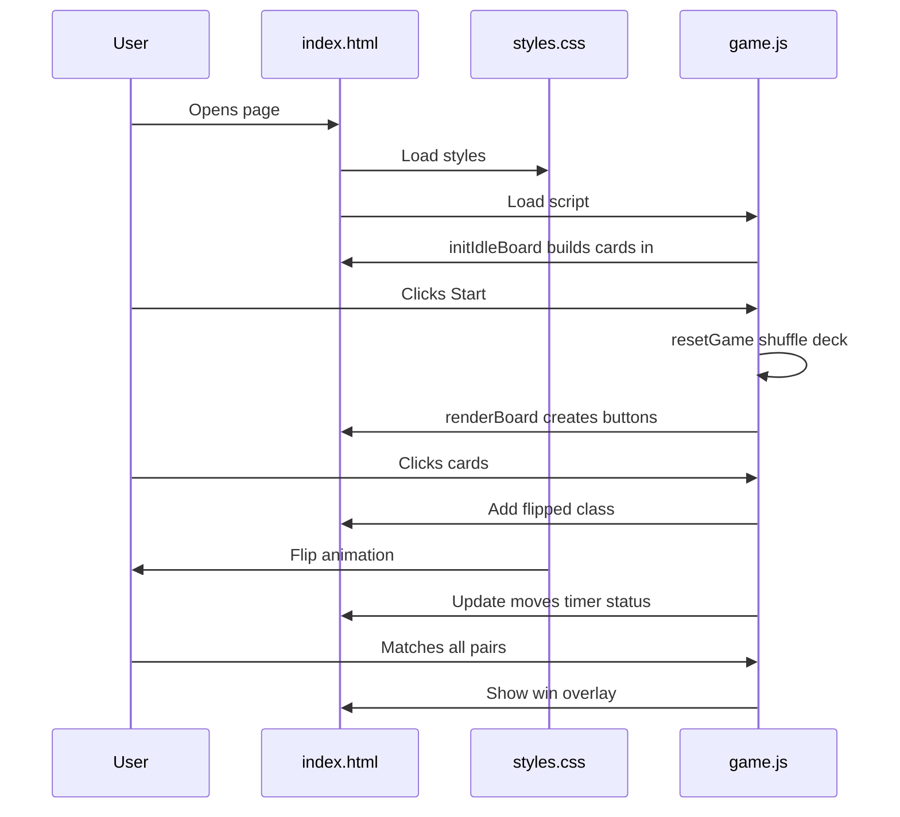

# Memory Match Website — Beginner's Guide

This document explains the three files that power your memory card game. You do not need prior coding experience; each section builds from simple ideas to how your project uses them.

---

## What is a website made of?

Most simple websites use three layers:

| Layer | File | Job |
|-------|------|-----|
| **Structure** | `index.html` | Defines *what* is on the page (title, buttons, empty areas for cards). |
| **Appearance** | `css/styles.css` | Defines *how* it looks (colors, layout, flip animation). |
| **Behavior** | `js/game.js` | Defines *what happens* when users click (shuffle, match, win). |

The browser loads them in order: HTML first, then CSS (linked from HTML), then JavaScript (also linked from HTML).

```
index.html  ──links to──►  styles.css  (makes it pretty)
     │
     └──links to──►  game.js  (makes it interactive)
```

Your folder layout:

```
web/
├── index.html      ← page skeleton
├── css/
│   └── styles.css  ← visual design
└── js/
    └── game.js     ← game logic
```

---

## How to open the game

1. **Easiest:** Double-click `index.html` in File Explorer.
2. **With a server:** From the project folder, run `python -m http.server 5500` (use another port if 8000 is blocked), then open `http://localhost:5500/web/` in your browser.

---

# 1. `index.html` — The page skeleton

HTML (HyperText Markup Language) describes content using **tags**. Tags usually come in pairs: `<tag>...</tag>`.

### Document header (lines 1–8)

```html
<!DOCTYPE html>
<html lang="en">
<head>
  ...
</head>
```

- `<!DOCTYPE html>` tells the browser this is a modern HTML page.
- `<html lang="en">` wraps the whole page; `lang="en"` helps screen readers and search tools.
- `<head>` holds metadata (not visible as main content):
  - `<meta charset="UTF-8">` — supports emoji and international characters.
  - `<meta name="viewport" ...>` — makes the layout work on phones.
  - `<title>Memory Match</title>` — text in the browser tab.
  - `<link rel="stylesheet" href="css/styles.css">` — **connects** your CSS file.

### Visible body (lines 9–47)

Everything inside `<body>` is what users see.

| Element | Purpose |
|---------|---------|
| `<main class="app">` | Main container; `class="app"` hooks into CSS styling. |
| `<header>` with `<h1>` | Big title “Memory Match”. |
| `<section class="hud">` | **H**eads-**u**p **d**isplay: moves and timer. |
| `<span id="moves">` | Placeholder for move count. **`id`** is unique so JavaScript can find and update it. |
| `<span id="timer">` | Placeholder for elapsed time. |
| `<div id="board">` | **Empty at first.** JavaScript will create all 16 cards here. |
| `<p id="status">` | Hint text (“Press Start to begin”). |
| `<button id="start-btn">` | Starts the game. |
| `<button id="restart-btn" disabled>` | Disabled until a game has started. |
| `<div id="win-overlay" class="hidden">` | Win popup; `hidden` class hides it until you win. |

### Script at the bottom (line 46)

```html
<script src="js/game.js"></script>
```

Loads `game.js` **after** the HTML exists, so the script can find elements like `#board` and `#moves`.

### Key HTML concepts

- **`class`** — A label for styling (can be shared by many elements). Example: `class="btn btn-primary"`.
- **`id`** — A unique name for one element. JavaScript uses `getElementById("moves")`.
- **`aria-*` attributes** — Help assistive technology (screen readers) understand the UI.
- **Comments** `<!-- ... -->` — Notes for humans; the browser ignores them.

---

# 2. `css/styles.css` — Look and layout

CSS (Cascading Style Sheets) selects HTML elements and sets visual rules.

### Basic syntax

```css
selector {
  property: value;
}
```

Example: `.btn-primary { background: #3b82f6; }` means “elements with class `btn-primary` get a blue background.”

### Global reset (lines 1–5)

```css
*, *::before, *::after {
  box-sizing: border-box;
}
```

The `*` selector means “everything.” `box-sizing: border-box` makes width calculations include padding so the grid does not overflow awkwardly.

### Page background and centering (lines 7–17)

- `body` — Full-height page, soft gradient background, centers content with **flexbox** (`display: flex`).
- `min-height: 100vh` — At least full viewport height (`vh` = % of window height).

### Layout sections

| Class | What it does |
|-------|----------------|
| `.app` | Limits width to 420px so the game stays compact on large screens. |
| `.hud` | Flex row for Moves and Time side by side. |
| `.board` | **CSS Grid** — 4 equal columns (`repeat(4, 1fr)`), 16 cards in a 4×4 layout. |
| `.board.disabled` | While resolving a pair, clicks are blocked (`pointer-events: none`). |

### Card flip animation (the clever part)

Each card is a `<button>` containing:

- `.card-inner` — Rotates in 3D.
- `.card-back` — Shows `?` (face down).
- `.card-front` — Shows the emoji; pre-rotated 180° so it appears correct when flipped.

When JavaScript adds class `flipped` to the button:

```css
.card.flipped .card-inner {
  transform: rotateY(180deg);
}
```

The inner box spins on the Y axis; `backface-visibility: hidden` hides the side facing away, so you only see one face at a time. That creates the flip effect **without** images or video.

Matched cards use `.card.matched` with a green-tinted front.

### Buttons and overlay

- `.btn-primary` / `.btn-secondary` — Blue main actions vs white outline style.
- `.btn:disabled` — Faded when not usable.
- `.win-overlay` — `position: fixed; inset: 0` covers the full screen with a semi-transparent dim layer.
- `.win-overlay.hidden` — `display: none` completely hides the popup.

### Responsive design (lines 222–234)

```css
@media (max-width: 360px) { ... }
```

Rules inside `@media` only apply on narrow screens (small phones): smaller gaps and emoji size.

---

# 3. `js/game.js` — Game logic

JavaScript runs in the browser and changes the page in real time.

### Constants (lines 1–3)

Fixed values that do not change during play:

- `SYMBOLS` — Eight emoji, each used twice (16 cards).
- `PAIR_COUNT` — 8 pairs.
- `MISMATCH_DELAY_MS` — 800 ms wait before flipping non-matching cards back.

### Connecting to HTML (lines 5–13)

```javascript
const boardEl = document.getElementById("board");
```

`document` is the loaded page. `getElementById` finds the element whose `id` matches. These variables are used throughout to update the DOM (**D**ocument **O**bject **M**odel — the live tree of HTML elements).

### Game state (lines 15–22)

Variables that **change** as you play:

| Variable | Meaning |
|----------|---------|
| `deck` | Array of 16 card objects: `{ id, symbol, matched }`. |
| `flipped` | Indices of cards currently face-up (0, 1, or 2 entries). |
| `moves` | Number of two-card attempts. |
| `locked` | `true` while waiting for mismatch animation or processing. |
| `gameActive` | `false` until Start; `false` again after win. |
| `elapsedSeconds` | Time since first card flip. |

### `shuffle` and `buildDeck` (lines 24–39)

1. Take 8 symbols, duplicate each into two cards.
2. **Fisher–Yates shuffle** — loops backward swapping random pairs so order is unpredictable.
3. Return a shuffled `deck` array.

### Timer helpers (lines 41–70)

- `formatTime` — Turns 65 seconds into `"1:05"`.
- `updateHud` — Writes moves and time into the HTML spans.
- `startTimer` / `stopTimer` — `setInterval` ticks every 1000 ms; `clearInterval` stops it on win or reset.

### `renderBoard` (lines 72–105)

Called whenever the display must refresh:

1. Clears `#board` (`innerHTML = ""`).
2. For each card in `deck`, creates a `<button>`, sets classes `flipped` / `matched`, injects `?` and emoji HTML.
3. Attaches **event listeners** — functions that run on click or keyboard.
4. Appends each button to the board.

This is why the grid starts empty in HTML: JavaScript **builds** all cards dynamically.

### `onCardClick` — Core gameplay (lines 107–147)

Flow in plain language:

```
Click card
  → Ignore if game paused, locked, already matched, or already flipped
  → Start timer on first flip
  → Add index to flipped[] and re-render
  → If only one card flipped: stop and wait for second click
  → If two cards flipped:
       Increment moves
       If symbols match: mark matched, clear flipped, check win
       If no match: wait 800ms, then clear flipped and re-render
```

`locked = true` prevents clicking a third card while two are being compared.

### `checkWin` (lines 149–157)

If every card has `matched: true`, stop the timer, show status text, fill `#win-message`, remove `hidden` from the overlay.

### `resetGame` and `initIdleBoard` (lines 159–192)

- **`resetGame`** — New shuffle, reset counters, enable Restart, disable Start, hide win overlay.
- **`initIdleBoard`** — Runs on page load: show a preview board but `gameActive = false` so cards do not respond until Start.

### Event wiring (lines 188–192)

```javascript
startBtn.addEventListener("click", resetGame);
```

“When Start is clicked, run `resetGame`.” Same for Restart and Play again.

---

# How the three files work together



1. **HTML** provides empty slots (`#board`, `#moves`) and buttons with ids.
2. **CSS** styles those elements and animates `.flipped` / `.matched`.
3. **JavaScript** creates cards, listens for clicks, updates text and classes.

---

# Glossary

| Term | Meaning |
|------|---------|
| **Tag** | HTML building block, e.g. `<div>`, `<button>`. |
| **Attribute** | Extra info on a tag, e.g. `id="board"`, `class="card"`. |
| **Selector** | CSS pattern that targets elements (`.card`, `#board`). |
| **Function** | Reusable block of JavaScript logic. |
| **Array** | Ordered list, e.g. `[card0, card1, ...]`. |
| **Event listener** | “When X happens, run Y.” |
| **DOM** | Live structure of the page that JS can read and change. |

---

# Ideas for learning more

1. Change an emoji in `SYMBOLS` in `game.js` and refresh the browser.
2. Change `background` on `body` in `styles.css` to see instant visual updates.
3. Edit the title in `index.html` `<h1>` — the simplest possible change.
4. Use browser **Developer Tools** (F12 → Elements / Console) to inspect cards and see errors.

---

# Relation to `iris_clustering.py`

The Python clustering script in the parent folder is **separate**. It loads CSV data and runs K-means; the web game does not call it. You can share or host only the `web` folder without Python.

---

*This guide describes the Memory Match project as built in the `web` directory.*
